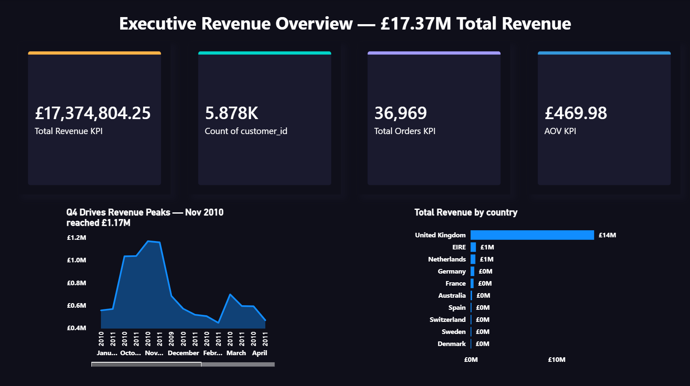
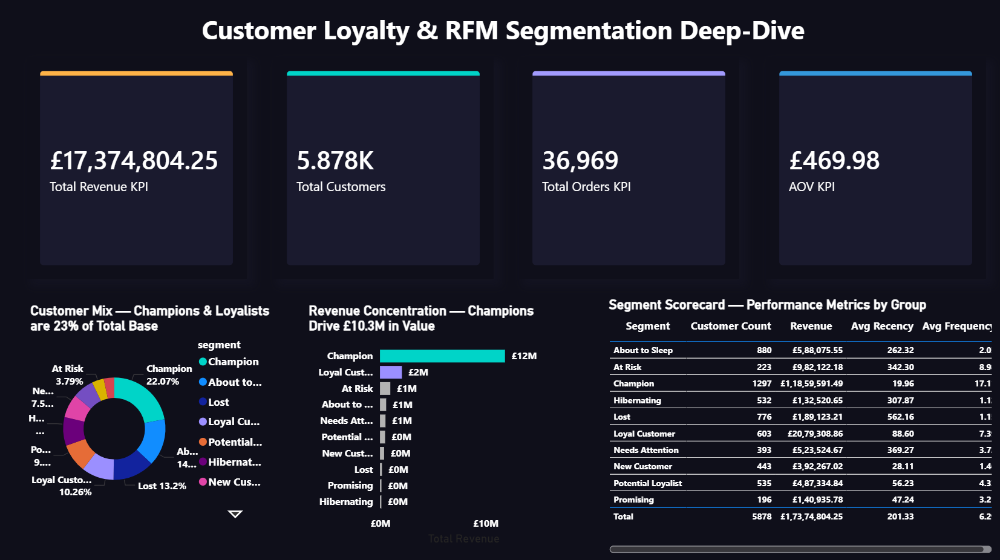
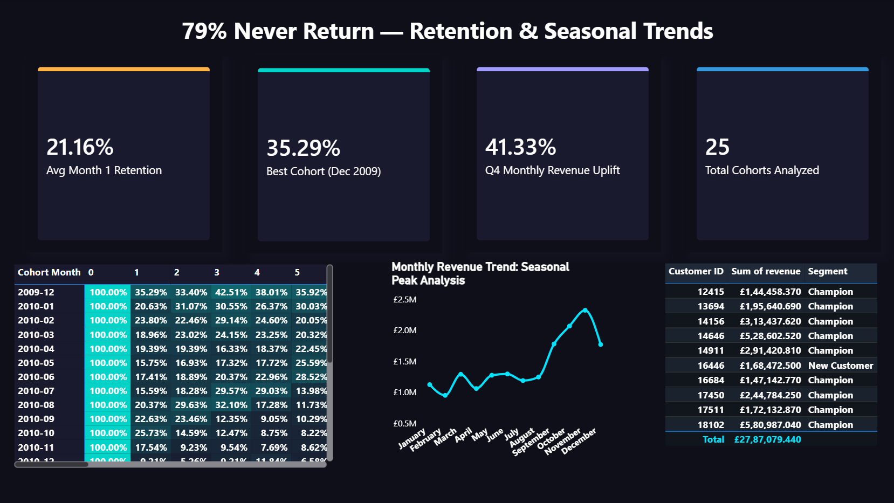
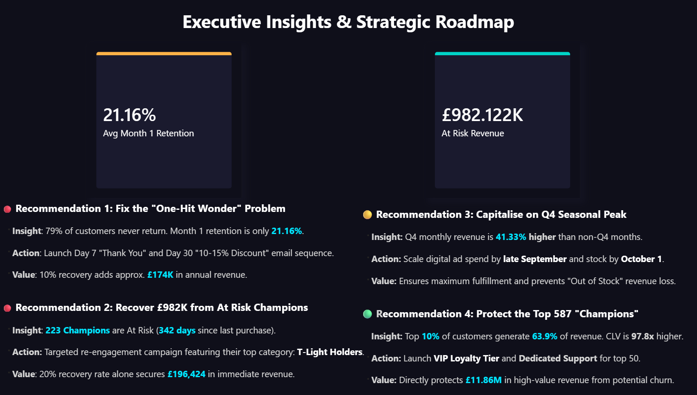

# Customer Revenue Intelligence & Retention Analytics System


> **End-to-end customer analytics system** that processes 1M+ UK e-commerce transactions, segments 5,878 customers by revenue potential, and surfaces £982K in immediately recoverable revenue — delivered through a 4-page executive Power BI dashboard.

📊 **[Live Dashboard → View on NovyPro](https://www.novypro.com/create_project/customer-revenue-intelligence--retention-analytics-system)**

---

## 🎯 Business Problem Statement

A UK-based online retailer operating across 43 countries had no systematic understanding of which customers drove revenue, why the majority never returned, and where the next pound of growth was coming from.

The core questions this project answers:

- Which customers account for a disproportionate share of revenue — and are they at risk?
- What is the true scale of the one-time buyer problem?
- Is the Q4 revenue spike real and statistically defensible — or noise?
- Where is untracked revenue hiding, and what is its magnitude?
- What are the top five actions the business should take *next week*?

**Stakeholder:** E-commerce leadership team and revenue operations function. Every finding in this analysis is accompanied by an exact monetary value and a proposed action with a quantified return.

---

## 📦 Dataset Overview

| Attribute | Detail |
|---|---|
| Source | UCI Online Retail II — Kaggle |
| Scope | UK e-commerce transactions, December 2009 – December 2011 |
| Period | 25 months |
| Raw rows | 1,067,371 |
| Clean rows | 779,407 (73.02% retention rate) |
| Unique customers | 5,878 |
| Unique orders | 36,969 |
| Unique products | 4,630 |
| Countries | 43 |

**Key columns:** InvoiceNo, StockCode, Description, Quantity, InvoiceDate, Price, CustomerID, Country

---

## 🏗️ Project Architecture

```
Raw CSV (1,067,371 rows)
        │
        ▼
[01] Data Quality Audit          → 7 issue types identified
        │
        ▼
[02] Data Cleaning (Python)      → 779,407 clean rows + 236,122 guest rows isolated
        │
        ├──────────────────────────────────────┐
        ▼                                      ▼
[03–07] EDA & Analysis          [Guest Checkout Analysis]
  - RFM Segmentation             - £3,229,538.96 unattributed
  - Cohort Retention             - 98.8% UK-based
  - CLV Profiling                - Avg item: £13.68
  - Revenue Trends
  - Statistical Tests (5 total)
        │
        ▼
[ingest_to_mysql.py]             → SQLAlchemy ingestion script
        │
        ▼
MySQL 8.0 Star Schema            → 5 tables, 20 SQL queries
        │
        ▼
Power BI Desktop                 → 4-page executive dashboard
        │
        ▼
NovyPro                          → Live hosted dashboard
```

---

## 🔍 Data Quality Audit

Before any analysis, a systematic audit of the raw 1,067,371-row dataset identified seven distinct data quality issues:

| # | Issue | Row Count | Action |
|---|---|---|---|
| 1 | Duplicate rows | 34,335 | Removed |
| 2 | Cancellation invoices (C-prefix) | 19,104 | Removed |
| 3 | Internal stock adjustment rows (zero price, warehouse entries) | 3,393 | Removed |
| 4 | Zero or negative price rows | 2,626 | Removed |
| 5 | Null CustomerID rows | 228,488 | Isolated as guest checkout segment |
| 6 | Near-zero revenue placeholder rows (PADS entries, bank charges) | 18 | Removed |
| 7 | CustomerID stored as float64 (data type integrity issue) | All rows | Converted to int32 post-null removal |

The null CustomerID rows were not discarded — they were analysed separately and found to represent £3,229,538.96 in unattributed guest checkout revenue.

---

## 🧹 Data Cleaning

All cleaning steps were applied sequentially in `notebooks/02_data_cleaning.ipynb`. Row counts below are cumulative.

| Step | Operation | Rows Removed | Running Total |
|---|---|---|---|
| Start | Raw dataset | — | 1,067,371 |
| 1 | Removed 34,335 duplicate rows | 34,335 | 1,033,036 |
| 2 | Removed 19,104 cancellation invoices (C-prefix InvoiceNo) | 19,104 | 1,013,932 |
| 3 | Removed 3,393 internal stock adjustment rows (zero-price warehouse entries) | 3,393 | 1,010,539 |
| 4 | Removed 2,626 zero/negative price rows | 2,626 | 1,007,913 |
| 5 | Isolated 228,488 null CustomerID rows for separate guest analysis | 228,488 | 779,425 |
| 6 | Removed 18 near-zero revenue placeholder rows (PADS + bank charges) | 18 | **779,407** |
| 7 | Engineered `Revenue` column: `Quantity × Price` | — | — |
| 8 | Converted CustomerID from float64 → int32 | — | — |

**Final clean dataset: 779,407 rows (73.02% of raw)**

---

## 📊 Analysis Performed

### 1. RFM Customer Segmentation

Customers scored on Recency, Frequency, and Monetary value using NTILE quintiles, then assigned to 10 named segments.

**Finding:** Champions (22.07% of customers) generate 68.26% of total revenue. The top two segments combined — Champions and Loyal Customers (32% of the base) — produce 80.23% of revenue. Pareto holds, and the concentration is even more extreme than the 80/20 rule would predict.

### 2. Cohort Retention Analysis

Month-0 to Month-N retention tracked across 25 monthly cohorts (December 2009 – December 2011).

**Finding:** 79% of customers never return after their first purchase. Average Month 1 retention across all 25 cohorts is 21.16%. The best-performing cohort (December 2009) retained 35.29% of customers into Month 1; the worst (December 2010) retained only 9.21%.

### 3. Customer Lifetime Value (CLV) Profiling

Historical CLV calculated per customer as the sum of all verified transactions in the dataset period.

**Finding:** Champion average CLV is £25,240 versus Lost customer average CLV of £258 — a 97.8x difference. This is not a prediction; it is a verified historical measurement of what each segment actually spent.

### 4. Revenue Trend & Seasonal Analysis

Monthly revenue aggregated and tested for Q4 vs non-Q4 differences using independent samples t-tests.

**Finding:** Q4 months generate 41.33% more revenue per month than non-Q4 months. This effect is statistically significant (p=0.003) and is driven entirely by transaction volume — not by customers spending more per order (AOV test: p=0.661, not significant). See Statistical Validation for the full honest accounting.

### 5. Geographic Revenue Analysis

Revenue broken down by country, with UK vs non-UK order value compared statistically.

**Finding:** UK revenue is £14,389,234, representing 82.82% of total identified customer revenue across 43 countries. Non-UK customers place orders that are, on average, £441 larger than UK customers (p~0.000, statistically significant).

### 6. Product Revenue Analysis

Products ranked by total revenue contribution; Pareto threshold identified.

**Finding:** 21.43% of products generate 80% of total revenue — product-level Pareto confirmed. The top-performing single product is REGENCY CAKESTAND 3 TIER at £277,656 in total revenue.

### 7. At-Risk Customer Recovery Analysis

223 customers classified as At Risk were profiled by revenue, recency, and purchase history to identify the optimal recovery product.

**Finding:** 223 At Risk customers represent £982,122 in recoverable revenue. Their average days since last purchase is 342 days. The product purchased by the largest share of this segment (105 of 223 customers) is WHITE HANGING HEART T-LIGHT HOLDER — making it the lead product for a targeted re-engagement campaign.

### 8. Guest Checkout Analysis

228,488 null-CustomerID rows isolated and analysed separately as an untracked revenue stream.

**Finding:** 236,122 valid guest checkout rows represent £3,229,538.96 in revenue — 98.8% UK-based, with an average order item value of £13.68. This revenue is real and completely unattributed to any customer record.

---

## 📐 Statistical Validation

All five tests conducted in `notebooks/07_statistical_tests.ipynb` using SciPy.

| Test | Variables | Result | p-value | Interpretation |
|---|---|---|---|---|
| Independent t-test | Champion vs Non-Champion revenue | **SIGNIFICANT** | p~0.000 | Champions are statistically distinct as a revenue group |
| Independent t-test | UK vs Non-UK order value | **SIGNIFICANT** | p~0.000 | Non-UK customers spend £441 more per order — not random variation |
| Chi-Square | RFM segment distribution | **SIGNIFICANT** | p~0.000 | Segment sizes are not randomly distributed |
| Independent t-test | Q4 vs Non-Q4 monthly revenue volume | **SIGNIFICANT** | p=0.003 | Q4 revenue uplift is real |
| Independent t-test | Q4 vs Non-Q4 AOV (order size) | **NOT SIGNIFICANT** | p=0.661 | Q4 lift is volume-driven, not spend-per-order-driven |

The Q4 AOV result is reported as-is. The business interpretation is important: Q4 success comes from more customers buying, not from the same customers spending more. Marketing strategy for Q4 should therefore focus on acquisition and traffic volume, not upselling.

---

## 🗄️ MySQL Star Schema

Database built in MySQL 8.0 using a star schema optimised for analytical query performance. Ingested via `scripts/ingest_to_mysql.py` using SQLAlchemy.

| Table | Type | Rows | Description |
|---|---|---|---|
| `dim_customer` | Dimension | 5,878 | One row per unique customer; CustomerID, country |
| `dim_product` | Dimension | 4,630 | One row per unique product; StockCode, description |
| `dim_date` | Dimension | 604 | One row per unique date; year, month, quarter, day-of-week |
| `fact_sales` | Fact | 779,407 | All clean transaction rows; revenue, quantity, foreign keys |
| `rfm_segments` | Derived | 5,878 | RFM scores and segment labels per customer |

Schema DDL in `sql/schema_ddl.sql`.

---

## 🔧 SQL Techniques Used

20 queries written across 4 files, covering standard and advanced SQL.

**`sql/rfm_queries.sql`** — 5 queries
- RFM score calculation using NTILE(5)
- Segment label assignment via CASE
- Segment revenue concentration
- Segment customer count distribution
- Top customers by CLV within each segment

**`sql/revenue_queries.sql`** — 5 queries
- Monthly revenue aggregation
- Q4 vs Non-Q4 revenue comparison
- Country-level revenue with percent contribution
- Product revenue ranking using DENSE_RANK
- Running total of revenue using window SUM

**`sql/cohort_queries.sql`** — 5 queries
- First purchase date per customer (CTE)
- Cohort month assignment
- Month-N retention rates using LAG
- Rolling 3-month average retention
- Cohort size vs retained customer count

**`sql/advanced_queries.sql`** — 5 queries
- Customer revenue percentile using PERCENT_RANK
- Revenue contribution using NTILE buckets
- At Risk segment recovery analysis
- Product affinity within segment using RANK
- Guest checkout revenue summary

**Techniques applied:** CTEs, Window Functions (RANK, DENSE_RANK, PERCENT_RANK, NTILE), LAG, Rolling Averages, Running Totals, Percent Contribution

---

## 📈 Power BI Dashboard

4-page executive dashboard built in Power BI Desktop, hosted on NovyPro.

### Page 1 — Executive Revenue Overview

KPIs: £17,374,804.25 total revenue, 5,878 customers, 36,969 orders, £469.98 AOV. Monthly revenue trend with Q4 peaks annotated. Revenue by country bar chart (43 countries).



### Page 2 — Customer Loyalty & RFM Segmentation Deep-Dive

Customer mix donut chart by segment. Revenue concentration bar chart showing Champions generating £10.3M. Full segment scorecard table: customer count, revenue, avg recency, avg frequency per segment.



### Page 3 — 79% Never Return: Retention & Seasonal Trends

KPIs: 21.16% avg Month 1 retention, 35.29% best cohort, 41.33% Q4 monthly revenue uplift, 25 cohorts analysed. Full cohort retention matrix (Month 0–5+). Monthly revenue trend chart with seasonal peak annotation.



### Page 4 — Executive Insights & Strategic Roadmap

Prioritised business recommendations with supporting data. Each recommendation is paired with the insight that motivates it, the proposed action, and the quantified value at stake.



---

## 💡 Business Recommendations

### 1. Fix the One-Hit Wonder Problem — £174K Annual Upside

79% of customers never return after their first purchase. Month 1 retention averages only 21.16%. A Day-7 thank-you email and Day-30 discount email sequence (10–15% offer) is a low-cost, high-return intervention. Even a 10% recovery rate on first-time buyers adds approximately £174,000 in annual revenue.

### 2. Recover £982,122 from 223 At-Risk Customers — £196K Immediately

223 customers classified as At Risk have not purchased in an average of 342 days. They collectively represent £982,122 in historical revenue. Their most-purchased product — WHITE HANGING HEART T-LIGHT HOLDER (bought by 105 of 223 At Risk customers) — is the recommended lead product for a targeted re-engagement campaign. A 20% recovery rate alone secures £196,424 in immediate revenue.

### 3. Capitalise on the Q4 Seasonal Peak — Maximum Inventory & Acquisition Spend

Q4 monthly revenue is 41.33% higher than non-Q4 months (p=0.003). This effect is volume-driven: more customers, not higher spend per order. Ad spend should scale from late September. Stock replenishment, particularly for high-volume low-cost items, should complete by October 1 to prevent fulfilment failure at peak.

### 4. Protect the Top 587 Champions — £11.86M Revenue at Stake

The top 587 customers (10% of the base) account for 63.9% of revenue. Champion average CLV is £25,240 versus £258 for Lost customers. A VIP loyalty tier — early sale access, free shipping, dedicated account support for the top 50 — directly protects £11.86M in high-value revenue from potential churn. Champions should never be treated like new customers.

### 5. Convert Guest Checkouts to Accounts — £645,907 Trackable Revenue

£3,229,538.96 in revenue is currently unattributed to any customer record. These are 236,122 valid guest checkout transactions — 98.8% from UK customers. A post-checkout prompt offering a 5% future discount for account creation is a low-friction intervention. At 20% conversion, £645,907 becomes attributable, trackable, and eligible for retention campaigns.

---

## 🔑 Key Insights Summary

- **£20,604,343.21** in true total business revenue (£17.37M identified + £3.23M guest checkout)
- **22.07% of customers** (Champions) generate **68.26% of revenue** — Pareto confirmed and exceeded
- **Top 32% of customers** generate **80.23% of revenue** — Pareto holds at segment level too
- **79% of customers** never return after their first purchase
- **Average Month 1 retention: 21.16%** across all 25 cohorts analysed
- **Best cohort retention: 35.29%** (December 2009) — **Worst: 9.21%** (December 2010)
- **Q4 monthly revenue is 41.33% higher** than non-Q4 (p=0.003) — but AOV difference is not significant (p=0.661), confirming this is a volume effect
- **Champion avg CLV: £25,240** vs **Lost avg CLV: £258** — a **97.8x difference**
- **Non-UK customers place £441 larger orders** than UK customers (p~0.000)
- **21.43% of products** generate **80% of revenue** — product-level Pareto confirmed

---

## 🚀 How to Reproduce

### Prerequisites

- Python 3.10+
- MySQL 8.0
- Power BI Desktop
- Kaggle account (to download the dataset)

### Step 1 — Clone the repository

```bash
git clone https://github.com/ShreenivasSB/customer-revenue-intelligence.git
cd customer-revenue-intelligence
```

### Step 2 — Install Python dependencies

```bash
pip install -r requirements.txt
```

### Step 3 — Download the dataset

Download the UCI Online Retail II dataset from Kaggle and place both Excel files into `data/raw/`.

### Step 4 — Run the notebooks in order

```bash
jupyter notebook
```

Execute notebooks in sequence:
1. `01_data_quality_audit.ipynb`
2. `02_data_cleaning.ipynb`
3. `03_rfm_segmentation.ipynb`
4. `04_cohort_analysis.ipynb`
5. `05_revenue_trends.ipynb`
6. `06_clv_analysis.ipynb`
7. `07_statistical_tests.ipynb`

Processed data exports to `data/processed/`.

### Step 5 — Set up MySQL

Create a database named `customer_revenue_intelligence` in MySQL 8.0 and run the schema:

```bash
mysql -u root -p customer_revenue_intelligence < sql/schema_ddl.sql
```

### Step 6 — Ingest data to MySQL

Update connection credentials in `scripts/ingest_to_mysql.py`, then run:

```bash
python scripts/ingest_to_mysql.py
```

### Step 7 — Run SQL queries

Execute queries in MySQL Workbench or CLI from the `sql/` directory.

### Step 8 — Open Power BI Dashboard

Open `dashboard/customer_revenue_intelligence.pbix` in Power BI Desktop. Update the MySQL data source connection if prompted.

---

## 📁 Project Structure

```
CUSTOMER_REVENUE_INTELLIGENCE/
│
├── dashboard/
│   └── customer_revenue_intelligence.pbix
│
├── data/
│   ├── processed/
│   └── raw/
│
├── notebooks/
│   ├── 01_data_quality_audit.ipynb
│   ├── 02_data_cleaning.ipynb
│   ├── 03_rfm_segmentation.ipynb
│   ├── 04_cohort_analysis.ipynb
│   ├── 05_revenue_trends.ipynb
│   ├── 06_clv_analysis.ipynb
│   └── 07_statistical_tests.ipynb
│
├── reports/
│   └── figures/
│       ├── dashboard_page1_executive_revenue_overview.png
│       ├── dashboard_page2_customer_loyalty_rfm.png
│       ├── dashboard_page3_retention_seasonal_trends.png
│       └── dashboard_page4_executive_insights_roadmap.png
│
├── scripts/
│   └── ingest_to_mysql.py
│
├── sql/
│   ├── schema_ddl.sql
│   ├── rfm_queries.sql
│   ├── revenue_queries.sql
│   ├── cohort_queries.sql
│   └── advanced_queries.sql
│
├── .gitignore
├── README.md
└── requirements.txt
```

---

## 🛠️ Tech Stack

| Tool | Version | Purpose |
|---|---|---|
| Python | 3.10 | EDA, data cleaning, analysis, statistical testing |
| Pandas | Latest | Data manipulation and transformation |
| Matplotlib / Seaborn | Latest | Visualisation within notebooks |
| SciPy | Latest | Statistical hypothesis testing (t-tests, chi-square) |
| MySQL | 8.0 | Star schema database for structured querying |
| SQLAlchemy | Latest | Python-to-MySQL data ingestion script |
| Power BI Desktop | Latest | 4-page executive dashboard |
| NovyPro | — | Live dashboard hosting |
| GitHub | — | Version control |

---

## 👤 Author

**Shreenivas S B**
MCA — Data Science | Dayananda Sagar University, Bangalore

[](https://www.linkedin.com/in/shreenivas-s-b-22b48a31a/)
[](https://github.com/ShreenivasSB)

---

*This project uses historical CLV calculated from verified transaction records — not predictive modelling. The ingestion process uses a Python script, not an automated pipeline. All statistical results, including non-significant findings, are reported as observed.*