# Customer Revenue Intelligence & Retention Analytics System


> **End-to-end customer analytics system** that processes 1M+ UK e-commerce transactions, segments 5,878 customers by revenue potential, models time-to-churn with survival analysis, and surfaces £982K in immediately recoverable revenue — delivered through an automated GitHub Actions pipeline into a cloud Postgres warehouse, a 4-page executive Power BI dashboard, and an interactive Streamlit reporting app.

📊 **[Executive Dashboard → View on Power BI](https://app.powerbi.com/view?r=eyJrIjoiODBhZWIyMjUtMDk1NS00MjYyLThiM2MtMDEwYjI5MTVkYzIzIiwidCI6ImRiMTljMjFjLWFlODctNDY4Yi05MjQ4LTFhMjkyZDM3OWRjMiJ9)**
🖥️ **[Interactive Reporting App → Launch on Streamlit](https://zowhklizimdbzjpc2zaq7z.streamlit.app/)**

---

## 🎯 Business Problem Statement

A UK-based online retailer operating across 43 countries had no systematic understanding of which customers drove revenue, why the majority never returned, and where the next pound of growth was coming from.

The core questions this project answers:

- Which customers account for a disproportionate share of revenue — and are they at risk?
- What is the true scale of the one-time buyer problem, and *when* is a customer likely to lapse?
- Is the Q4 revenue spike real and statistically defensible — or noise?
- Where is untracked revenue hiding, and what is its magnitude?
- What are the top actions the business should take *next week*?

**Stakeholder:** E-commerce leadership team and revenue operations function. Every finding in this analysis is accompanied by an exact monetary value and a proposed action with a quantified return.

---

## 📦 Dataset Overview

| Attribute | Detail |
|---|---|
| Source | UCI Online Retail II — Kaggle |
| Scope | UK e-commerce transactions, December 2009 – December 2011 |
| Period | 25 months |
| Raw rows | 1,067,371 |
| Clean rows | 779,407 (73.02% retention rate) |
| Unique customers | 5,878 |
| Unique orders | 36,969 |
| Unique products | 4,630 |
| Countries | 43 |

**Key columns:** InvoiceNo, StockCode, Description, Quantity, InvoiceDate, Price, CustomerID, Country

*Note: the 4,630 figure above is products sold to identified customers. The warehouse's `dim_product` table holds 4,744 stock codes — that count is a union with products that only ever appear in guest checkout orders. See [Data Warehouse](#data-warehouse).*

---

## 🏗️ Project Architecture

The project runs two parallel tracks from the same raw dataset: a **local exploratory track** (notebooks, manual, used to prototype every technique and produce the SQL practice warehouse) and an **automated production track** (scripts + GitHub Actions, scheduled, feeds the live dashboard).

```
                    ┌───────────────────────────────────┐
                    │   Raw CSV — UCI Online Retail II    │
                    │   1,067,371 rows                    │
                    └──────────────────┬───────────────────┘
                                        │
              ┌─────────────────────────┴──────────────────────────┐
              ▼                                                      ▼
  LOCAL EXPLORATORY TRACK                               AUTOMATED PRODUCTION TRACK
  (Jupyter notebooks, run manually)                     (scripts/ + GitHub Actions, scheduled)
              │                                                      │
  01 Data Quality Audit                                  scripts/clean_data.py
  02 Data Cleaning        ──► MySQL 8.0                  (same cleaning rules,
  03 RFM (pandas pd.qcut)      local warehouse             unattended)
  04 Cohort Retention          (ingest_to_mysql.py)               │
  05 Revenue Trends                                                ▼
  06 CLV Analysis                                        scripts/data_quality_gate.py
  07 Statistical Tests                                   17 automated PASS/FAIL checks
     (Welch's t-test / Shapiro-Wilk /                    (blocks the load job on any FAIL)
      Levene's / Mann-Whitney U)                                   │
  08 Survival Analysis                                              ▼
     (Kaplan-Meier / Cox PH)                             scripts/load_to_supabase.py
              │                                          → Supabase Postgres (cloud)
              │                                          → sql/compute_rfm.sql
              │                                            (RFM via SQL NTILE(5), not pandas)
              │                                                     │
              │                        orchestrated by GitHub Actions
              │                        (weekly cron + manual dispatch + push-triggered)
              │                                                     │
              └────────────────────────────┬────────────────────────┘
                                            ▼
                            Supabase Postgres — production warehouse
                                            │
                          ┌─────────────────┴──────────────────┐
                          ▼                                      ▼
              Power BI Desktop (ODBC)              streamlit_app/ (SQLAlchemy/psycopg2)
              4-page executive dashboard           6-page interactive reporting app
                          │                                      │
                          ▼                                      ▼
              Power BI Service — hosted             Streamlit Community Cloud — hosted
```

Both consumers read the *same* warehouse — no separate export, no data drift between them. Power BI is the fixed executive report; the Streamlit app is the ad-hoc, filterable, drill-down companion (see [Streamlit Reporting App](#streamlit-reporting-app) below).

---

## 🔍 Data Quality Audit

Before any analysis, a systematic audit of the raw 1,067,371-row dataset identified seven distinct data quality issues:

| # | Issue | Row Count | Action |
|---|---|---|---|
| 1 | Duplicate rows | 34,335 | Removed |
| 2 | Cancellation invoices (C-prefix) | 19,104 | Removed |
| 3 | Internal stock adjustment rows (zero price, warehouse entries) | 3,393 | Removed |
| 4 | Zero or negative price rows | 2,626 | Removed |
| 5 | Null CustomerID rows | 228,488 | Isolated as guest checkout segment |
| 6 | Near-zero revenue placeholder rows (PADS entries, bank charges) | 18 | Removed |
| 7 | CustomerID stored as float64 (data type integrity issue) | All rows | Converted to int32 post-null removal |

The null CustomerID rows were not discarded — they were analysed separately and found to represent £3,229,538.96 in unattributed guest checkout revenue.

An eighth issue surfaced later, via the Power BI repoint to the cloud warehouse rather than the original audit: **~171 case-variant `StockCode` "duplicates"** (e.g. `85123A` vs `85123a`) plus at least one whitespace-variant (`47503J` vs `47503J `) — the same product, split across two primary keys by inconsistent data entry. See the [Data Warehouse](#data-warehouse) engineering note for how this was caught and fixed.

---

## 🧹 Data Cleaning

All cleaning steps were applied sequentially in `notebooks/02_data_cleaning.ipynb`. Row counts below are cumulative.

| Step | Operation | Rows Removed | Running Total |
|---|---|---|---|
| Start | Raw dataset | — | 1,067,371 |
| 1 | Removed 34,335 duplicate rows | 34,335 | 1,033,036 |
| 2 | Removed 19,104 cancellation invoices (C-prefix InvoiceNo) | 19,104 | 1,013,932 |
| 3 | Removed 3,393 internal stock adjustment rows (zero-price warehouse entries) | 3,393 | 1,010,539 |
| 4 | Removed 2,626 zero/negative price rows | 2,626 | 1,007,913 |
| 5 | Isolated 228,488 null CustomerID rows for separate guest analysis | 228,488 | 779,425 |
| 6 | Removed 18 near-zero revenue placeholder rows (PADS + bank charges) | 18 | **779,407** |
| 7 | Normalised `StockCode` casing/whitespace (`.str.strip().str.upper()`) | — | — |
| 8 | Engineered `Revenue` column: `Quantity × Price` | — | — |
| 9 | Converted CustomerID from float64 → int32 | — | — |

**Final clean dataset: 779,407 rows (73.02% of raw)**

This exact waterfall — same rules, same order — is re-implemented as a standalone script, `scripts/clean_data.py`, so it can run unattended. See below.

---

## ⚙️ Automated Data Pipeline

The production track is a real, scheduled ETL pipeline — not a script run by hand. `.github/workflows/etl_pipeline.yml` defines three jobs, each gating the next via `needs:`:

```
clean  ──►  quality-gate  ──►  load
```

- **`clean`** — runs `scripts/clean_data.py` (downloads the raw UCI zip if not already present, applies the cleaning waterfall above, writes `online_retail_clean.csv`, `guest_checkout.csv`, and `cleaning_summary.json`), uploads the outputs as a build artifact.
- **`quality-gate`** — runs `scripts/data_quality_gate.py`, **17 automated PASS/FAIL checks** covering volume sanity bands (row counts, null rates, duplicate rates, cancellation rates within expected ranges), file/summary consistency, key-column completeness, value sanity (no non-positive price/quantity, no sub-penny revenue, no leaked cancellations), revenue totals within a sanity band, and guest-stream integrity. If any check fails, the workflow stops here — `load` never runs.
- **`load`** — runs `scripts/load_to_supabase.py`: ensures the Postgres schema exists, truncates and reloads all six warehouse tables from the cleaned CSVs, then runs `sql/compute_rfm.sql` to recompute RFM segments **in SQL** via `NTILE(5)` window functions, and verifies row counts.

**Triggers:** a weekly cron (`0 3 * * 1` — every Monday, 03:00 UTC), `workflow_dispatch` for on-demand manual runs, and a push trigger scoped to the pipeline's own files. The dataset itself is a static historical snapshot, so the schedule exists to demonstrate real orchestration rather than to track live data drift — an honest distinction worth stating outright in an interview rather than implying the data changes daily.

Every load is idempotent (truncate + reinsert), so re-running on a schedule against unchanged source data is always safe.

**Verified end-to-end, run twice on `main`:**

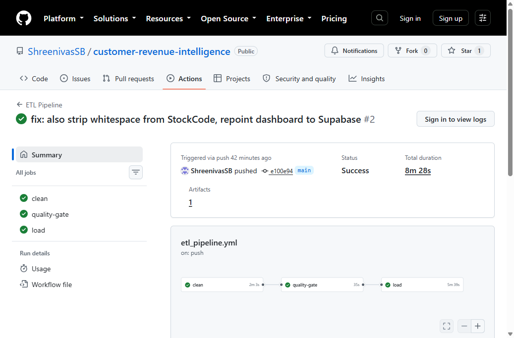

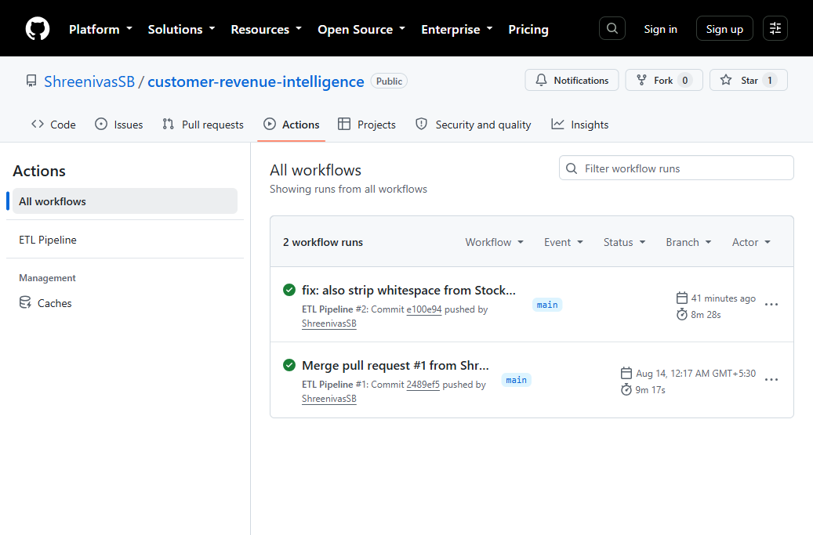

---

## 📊 Analysis Performed

### 1. RFM Customer Segmentation

Customers scored on Recency, Frequency, and Monetary value using NTILE quintiles, then assigned to 10 named segments.

**Finding:** Champions (22.07% of customers) generate 68.26% of total revenue. The top two segments combined — Champions and Loyal Customers (32% of the base) — produce 80.23% of revenue. Pareto holds, and the concentration is even more extreme than the 80/20 rule would predict.

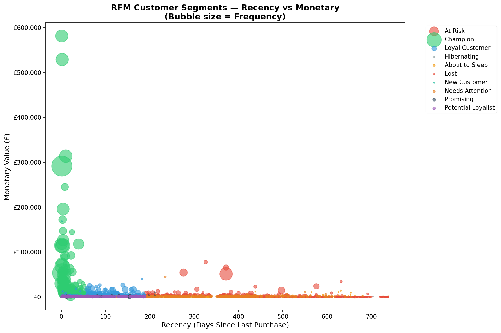

### 2. Cohort Retention Analysis

Month-0 to Month-N retention tracked across 25 monthly cohorts (December 2009 – December 2011).

**Finding:** 79% of customers never return after their first purchase. Average Month 1 retention across all 25 cohorts is 21.16%. The best-performing cohort (December 2009) retained 35.29% of customers into Month 1; the worst (December 2010) retained only 9.21%.

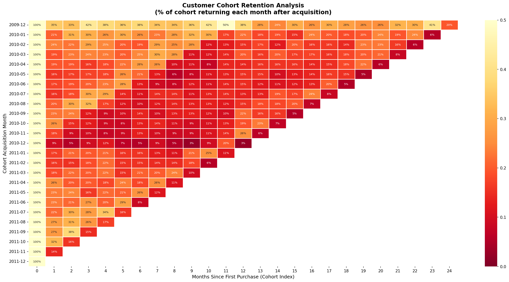

### 3. Customer Lifetime Value (CLV) Profiling

Historical CLV calculated per customer as the sum of all verified transactions in the dataset period.

**Finding:** Champion average CLV is £9,144 versus Lost customer average CLV of £244 — a 37.5x difference. This is not a prediction; it is a verified historical measurement of what each segment actually spent.

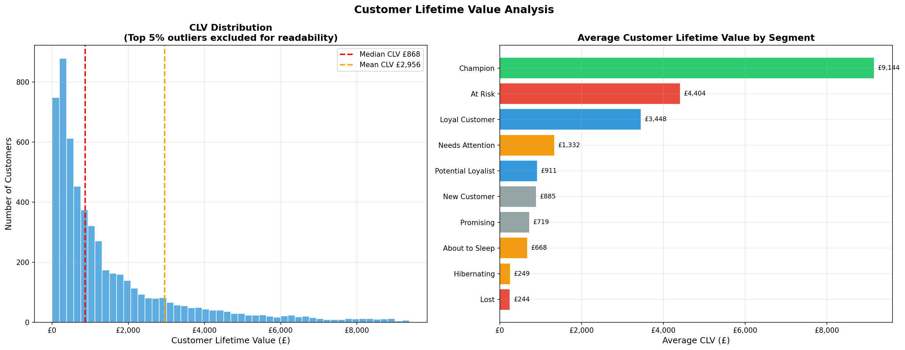

### 4. Revenue Trend & Seasonal Analysis

Monthly revenue aggregated and tested for Q4 vs non-Q4 differences using Welch's t-test (unequal-variance correction), cross-checked with Mann-Whitney U.

**Finding:** Q4 months generate 41.33% more revenue per month than non-Q4 months in the observed data, but this does *not* hold up as statistically significant once tested correctly (Welch's p=0.052, Mann-Whitney U p=0.055) — Levene's test shows the two groups have unequal variance, which violates the assumption behind the simpler Student's t-test originally used here (which had misleadingly reported p=0.003). With only 25 months of data (7 Q4, 18 non-Q4), we can't statistically rule out that this gap is due to chance, even though the observed effect is real. Order size is unaffected either way (AOV test: p=0.697, not significant). See Statistical Validation for the full honest accounting.

### 5. Geographic Revenue Analysis

Revenue broken down by country, with UK vs non-UK order value compared statistically.

**Finding:** UK revenue is £14,389,234, representing 82.82% of total identified customer revenue across 43 countries. Non-UK customers place orders that are, on average, £441 larger than UK customers (p~0.000, statistically significant).

### 6. Product Revenue Analysis

Products ranked by total revenue contribution; Pareto threshold identified — both at the customer and product level.

**Finding:** 21.43% of products generate 80% of total revenue — product-level Pareto confirmed. At the individual customer level (a finer cut than the RFM segment concentration in Finding #1), 23.04% of customers generate 80% of revenue. The top-performing single product is REGENCY CAKESTAND 3 TIER at £277,656 in total revenue.

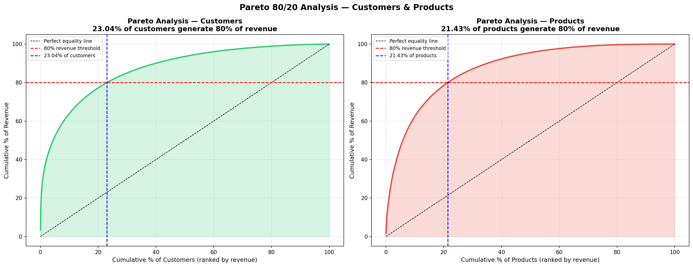

### 7. At-Risk Customer Recovery Analysis

223 customers classified as At Risk were profiled by revenue, recency, and purchase history to identify the optimal recovery product.

**Finding:** 223 At Risk customers represent £982,122 in recoverable revenue. Their average days since last purchase is 342 days. The product purchased by the largest share of this segment (105 of 223 customers) is WHITE HANGING HEART T-LIGHT HOLDER — making it the lead product for a targeted re-engagement campaign.

### 8. Guest Checkout Analysis

228,488 null-CustomerID rows isolated and analysed separately as an untracked revenue stream.

**Finding:** 236,122 valid guest checkout rows represent £3,229,538.96 in revenue — 98.8% UK-based, with an average order item value of £13.68. This revenue is real and completely unattributed to any customer record, and — unlike in the original analysis — is now persisted as a queryable table (`fact_guest_checkout`) in the production warehouse, not just a notebook-only computation.

---

## ⏳ Survival Analysis — Time-to-Churn

`notebooks/08_survival_analysis.ipynb` — Kaplan-Meier and Cox Proportional Hazards, reading directly from the Supabase warehouse. This complements the cohort retention analysis above (Finding #2) with a formal survival-analysis technique: instead of a cohort-by-cohort return-rate table, it models *when* a customer is likely to lapse and *which* customer-level factors raise or lower that risk, producing a per-customer risk score usable for prioritising retention outreach.

**Churn definition** (retail data has no observed "cancellation" event, so churn has to be defined by a business rule, not inferred): a customer is **churned** if more than 180 days have elapsed since their last purchase; otherwise they are **right-censored** — still active as of the dataset's end date, with an unknown future. 180 days was chosen and checked against the recency distribution for a balanced event rate; a shorter, 90-day threshold would have classified over half the base as "churned," which is too aggressive for a non-contractual retail relationship.

Of 5,878 customers: **2,401 churned (40.8%)**, **3,477 still active/censored (59.2%)**. 1,203 customers (20.5%) placed only a single order — consistent with the 79%-never-return finding above.

### Kaplan-Meier — empirical retention decay

Median survival time is **mathematically undefined** within the ~2-year observed window — the survival curve never drops below 50%. Reported honestly as undefined rather than extrapolated: survival probability at the end of the observation window (day 739) is **53.1%**.

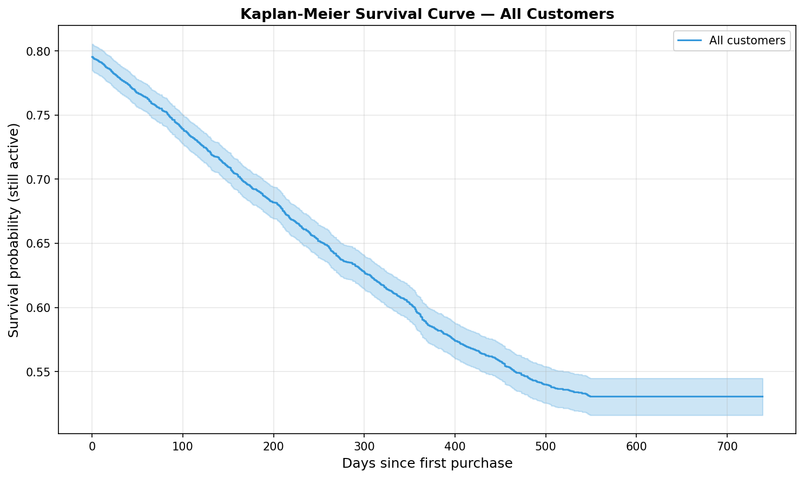

Stratified by UK vs non-UK (log-rank test): survival at window end is 52.8% (UK, n=5,349) vs 56.2% (non-UK, n=529) — a small gap that is **not statistically significant** (log-rank p=0.348). Absence of a country effect is reported as a real finding, not omitted.

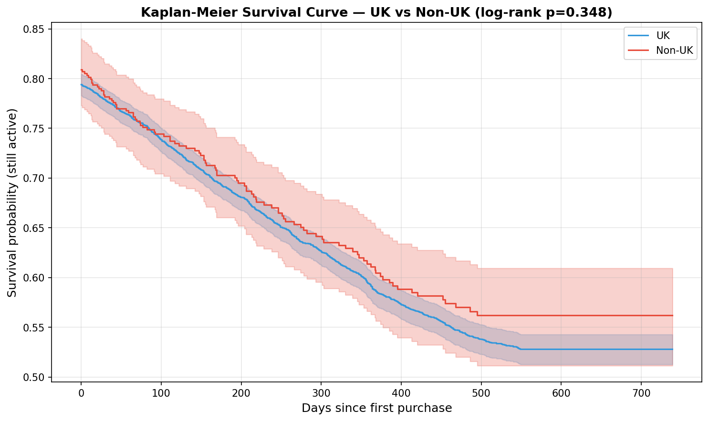

### Cox Proportional Hazards — what drives churn risk

Covariates: `total_orders` (order frequency, log-transformed) and `avg_order_value` (spend per order) — not `total_revenue`, since revenue is just orders × AOV and including all three would be multicollinear. Recency was deliberately excluded, since it's literally how the churn label itself is derived — including it would be circular.

**Finding:** order **frequency** is the dominant, highly significant driver of churn hazard (hazard ratio ≈ 0.07, p<0.001) — a customer with double the order count carries roughly 16% of the churn hazard of a customer with half as many orders. Order **value** (AOV, p=0.43) and **country** (log-rank p=0.35) are not significant predictors once frequency is accounted for. The model's concordance index is **0.87** (0.5 = no better than chance, 1.0 = perfect ranking) — strong discriminative power.

**Reported honestly, not hidden:** the initial model's proportional-hazards assumption check flagged both `total_orders` and `is_uk`. Stratifying `is_uk` (rather than treating it as a regular covariate) fully resolved its violation. Log-transforming `total_orders` did not fully resolve its flag even after remediation — documented in the notebook as very likely the well-known large-sample over-sensitivity of this specific test at n=5,878 (per lifelines' own documentation), rather than pursued further into a harder-to-interpret time-varying-coefficient model. This caveat is itself persisted as a queryable row in `survival_model_summary`, not left as prose only.

**Persisted to Supabase** (`sql/survival_schema.sql`, refreshed by re-running the notebook — kept separate from the core star schema since this isn't part of the scheduled ETL pipeline):
- `survival_customer_features` — 5,878 rows: per-customer duration, churn event flag, covariates, and Cox partial hazard risk score.
- `survival_model_summary` — 13 rows: Kaplan-Meier, log-rank, and Cox metrics, plus the PH-assumption caveat as queryable text.

---

## 📐 Statistical Validation

All five tests conducted in `notebooks/07_statistical_tests.ipynb` using SciPy. Every two-group comparison uses **Welch's t-test** (does not assume equal variance) rather than Student's t-test, backed by Shapiro-Wilk normality checks and Levene's variance-equality checks on each pair, and cross-checked against **Mann-Whitney U** (a nonparametric test with no distributional assumptions). Normality was violated in every comparison — retail transaction data is heavily right-skewed, not normal — but Welch's t-test and Mann-Whitney U agreed on every verdict, which is real evidence the significant/not-significant calls are robust despite that violation.

| Test | Variables | Result | Welch's p | Mann-Whitney p | Interpretation |
|---|---|---|---|---|---|
| Welch's t-test | Champion vs Non-Champion revenue | **SIGNIFICANT** | p<0.0001 | p<0.0001 | Champions are statistically distinct as a revenue group |
| Welch's t-test | UK vs Non-UK order value | **SIGNIFICANT** | p<0.0001 | p<0.0001 | Non-UK customers spend £441 more per order — not random variation |
| Chi-Square | RFM segment distribution | **SIGNIFICANT** | p~0.000 | n/a | Segment sizes are not randomly distributed |
| Welch's t-test | Q4 vs Non-Q4 monthly revenue volume | **NOT SIGNIFICANT** | p=0.052 | p=0.055 | Levene's test shows unequal variance between groups — Student's t-test (originally used) wrongly reported this as significant (p=0.003); with only 25 months of data, the observed 41.33% Q4 uplift can't be statistically distinguished from chance |
| Welch's t-test | Q4 vs Non-Q4 AOV (order size) | **NOT SIGNIFICANT** | p=0.697 | p=0.336 | Q4 lift (where real) is volume-driven, not spend-per-order-driven |

Two honest results worth calling out explicitly:
- **Q4 AOV** is reported as not significant either way — the business interpretation holds regardless: Q4 success (where it exists) comes from more customers buying, not from the same customers spending more.
- **Q4 monthly revenue volume** changed verdict under the corrected test — this is the one place where fixing the statistical methodology actually changed the conclusion, not just its confidence. The original notebook used Student's t-test, which assumes equal variance between groups; Levene's test shows that assumption doesn't hold here, so its p=0.003 significant result wasn't trustworthy. Welch's t-test corrects for that and lands at p=0.052 — just above the conventional 0.05 threshold. The 41.33% observed Q4 premium is real in this dataset, but statistically we can't rule out it's due to chance with only 7 Q4 months to compare against 18 non-Q4 months.

Chi-square (RFM segment distribution) is left as Student's — it's a different test family entirely, not a t-test, so the Welch's/Shapiro-Wilk/Levene's upgrade doesn't apply to it.

---

## 🗄️ Data Warehouse

The project runs two warehouses side by side, deliberately: **MySQL locally** (the original build, kept as the SQL-practice/demonstration layer behind the 21 queries below) and **Supabase Postgres in the cloud** (the production warehouse the automated pipeline and the live dashboard actually run against).

### Local — MySQL 8.0

Schema in `sql/schema_ddl.sql`. Ingested via `scripts/ingest_to_mysql.py` (SQLAlchemy). Five tables: `dim_customer`, `dim_product`, `dim_date`, `fact_sales`, `rfm_segments` (the last populated by pandas `pd.qcut` from notebook 03, not SQL). This is the warehouse the 21 SQL queries in the next section are written against.

### Cloud — Supabase Postgres

Schema in `sql/schema_ddl_postgres.sql` (a straight Postgres-dialect port, with explicit FK indexes since Postgres — unlike MySQL — doesn't auto-index foreign keys). Loaded and refreshed by the [Automated Data Pipeline](#automated-data-pipeline) above.

| Table | Rows | Description |
|---|---|---|
| `dim_customer` | 5,878 | One row per unique customer; customer_id, country |
| `dim_product` | 4,744 | Union of stock codes across both identified-customer *and* guest checkout orders |
| `dim_date` | 604 | One row per unique date; year, month, quarter, day-of-week, is_q4 |
| `fact_sales` | 779,407 | £17,374,804.25 — all clean transaction rows, identified customers only |
| `fact_guest_checkout` | 236,122 | £3,229,538.96 — closes the audit's original "guest revenue never persisted" gap |
| `rfm_segments` | 5,878 | RFM scores and segment labels, computed **in SQL** via `NTILE(5)` (`sql/compute_rfm.sql`) — not pandas |

Plus the two survival-analysis tables described above (`survival_customer_features`, `survival_model_summary`), kept in a separate DDL file since they're refreshed by re-running a notebook, not by the scheduled pipeline.

### Engineering notes

Two real troubleshooting stories worth knowing for an interview follow-up, not smoothed over:

- **A genuine data-quality bug, caught by the BI layer, not the original audit.** The raw dataset has ~171 case-variant `StockCode` values (`85123A` vs `85123a`) plus at least one whitespace-variant, all confirmed to share identical product descriptions — inconsistent data entry, not distinct SKUs. Postgres treats these as valid, distinct, case-sensitive primary keys; MySQL's default collation happened to treat them as equal. Power BI's VertiPaq engine compares relationship keys case-insensitively, so it refused to load the data model against Supabase until this was fixed. Root-caused and fixed by normalising `StockCode` via `.str.strip().str.upper()` in `clean_data.py` — a small, honest example of a downstream tool surfacing an upstream data issue that a purely SQL-side check hadn't caught.
- **A Power BI ↔ Postgres connectivity workaround.** Power BI Desktop's native `PostgreSQL.Database` connector failed against both Supabase connection hosts with a `remote certificate is invalid` TLS error — an environment-specific bug in the connector's bundled Npgsql driver, not a Supabase or Power BI incompatibility in general (stale root CA store, AV SSL interception, and an outdated Power BI Desktop build were all ruled out). Worked around by installing the official `psqlODBC` driver and connecting through an ODBC DSN (`sslmode=require`) instead. If reconnecting this dashboard on a different machine, try the native connector first.

---

## 🔧 SQL Techniques Used

21 queries written across 4 files against the local MySQL warehouse — covering standard and advanced SQL, and used for hands-on demonstration of CTEs, window functions, and ranking logic.

**`sql/rfm_queries.sql`** — 6 queries
- Customer RFM scores with segment labels
- Segment distribution — customer count and revenue
- Champion customers detail
- At Risk customers — recovery priority list
- Revenue contribution by segment (Pareto in SQL)
- Product affinity for At Risk customers

**`sql/revenue_queries.sql`** — 5 queries
- Monthly revenue trend
- Revenue by country (Top 10)
- Monthly rolling 3-month average revenue (window function)
- Q4 vs Non-Q4 revenue comparison
- Top 10 products by revenue

**`sql/cohort_queries.sql`** — 4 queries
- Customer first purchase month (CTE, cohort assignment)
- Cohort retention — months active after acquisition
- Month 1 retention rate per cohort
- Best and worst retention cohorts (RANK)

**`sql/advanced_queries.sql`** — 6 queries
- Customer revenue ranking with RANK()
- Product revenue ranking with DENSE_RANK()
- Running total revenue by month (window SUM)
- Customer percentile ranking (PERCENT_RANK, NTILE)
- Month-over-month revenue growth with LAG()
- Revenue percent contribution by country

**Techniques applied:** CTEs, Window Functions (RANK, DENSE_RANK, PERCENT_RANK, NTILE), LAG, Rolling Averages, Running Totals, Percent Contribution.

**On the NTILE claim specifically:** these 21 MySQL queries read from an `rfm_segments` table populated by pandas — they don't compute RFM themselves. The actual SQL `NTILE(5)` RFM computation lives in `sql/compute_rfm.sql`, runs against Postgres as part of the production pipeline, and is a direct, verified port of the same segment-assignment rule waterfall used in notebook 03 — see [Data Warehouse](#data-warehouse) and [Automated Data Pipeline](#automated-data-pipeline).

---

## 📈 Power BI Dashboard

4-page executive dashboard built in Power BI Desktop, published to Power BI Service, connected to the Supabase warehouse via ODBC (see the connectivity note above).

### Page 1 — Executive Revenue Overview

KPIs: £17,374,804.25 total revenue, 5,878 customers, 36,969 orders, £469.98 AOV. Monthly revenue trend with Q4 peaks annotated. Revenue by country bar chart (43 countries).

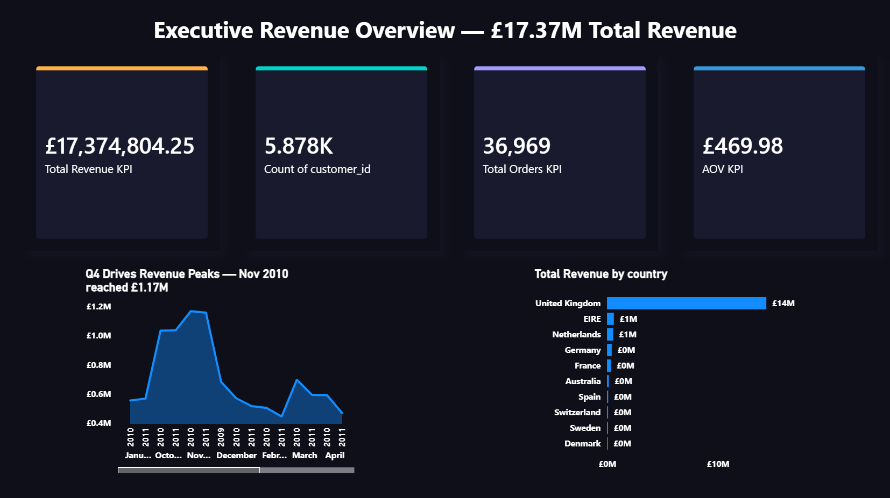

### Page 2 — Customer Loyalty & RFM Segmentation Deep-Dive

Customer mix donut chart by segment. Revenue concentration bar chart showing Champions generating £10.3M. Full segment scorecard table: customer count, revenue, avg recency, avg frequency per segment.

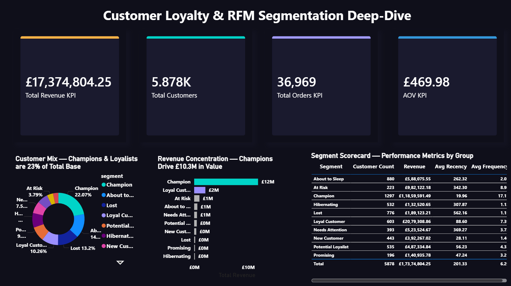

### Page 3 — 79% Never Return: Retention & Seasonal Trends

KPIs: 21.16% avg Month 1 retention, 35.29% best cohort, 41.33% Q4 monthly revenue uplift, 25 cohorts analysed. Full cohort retention matrix (Month 0–5+). Monthly revenue trend chart with seasonal peak annotation.

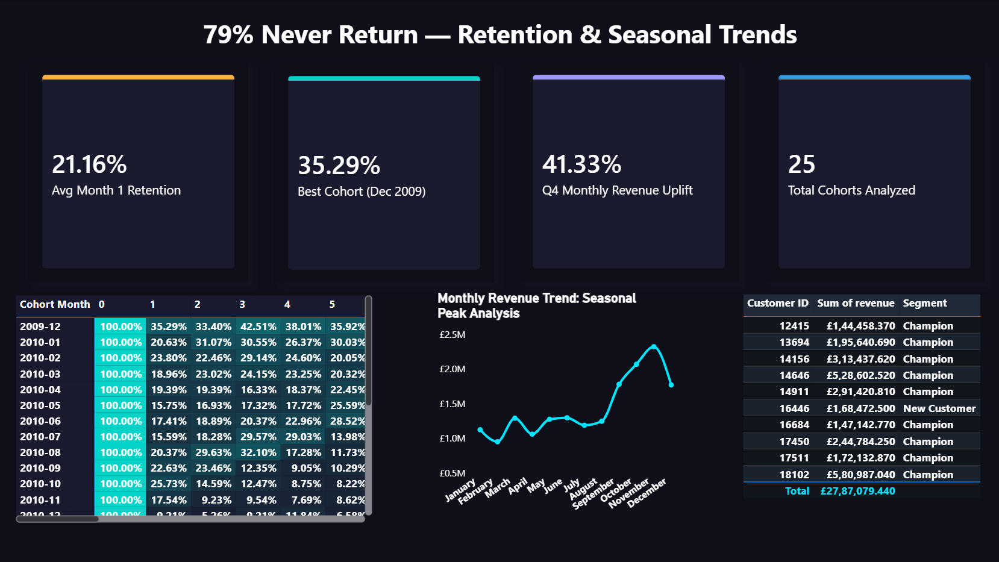

### Page 4 — Executive Insights & Strategic Roadmap

Prioritised business recommendations with supporting data. Each recommendation is paired with the insight that motivates it, the proposed action, and the quantified value at stake.

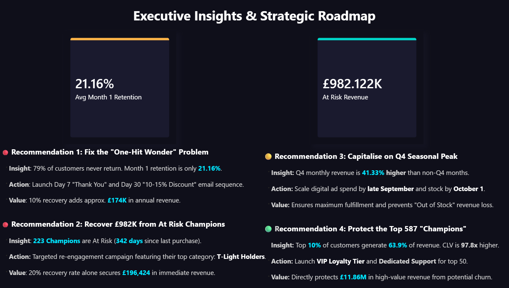

---

## 🖥️ Streamlit Reporting App

Power BI is the fixed, 4-page executive report. `streamlit_app/` is its interactive companion — same Supabase warehouse, same numbers, but with filters, drill-downs, and an exportable target list that a static report can't offer. Framed deliberately as a **reporting/BI app, not a deployed ML product**: every figure is a live SQL aggregate, not a prediction served to a user — the one place the app touches a model output, the Cox risk score, it's just displaying and ranking by a number already computed and persisted in notebook 08, the same as any other warehouse column.

**[Launch the live app →](https://zowhklizimdbzjpc2zaq7z.streamlit.app/)** (Streamlit Community Cloud, free tier)

Six pages: Executive Overview, RFM Segmentation (customer-level scatter + segment drill-down table), Cohort Retention (interactive heatmap), Revenue & Seasonality (the same honest statistical validation table as above), Churn Risk (Kaplan-Meier curve re-fit live against the warehouse via `lifelines`, plus a downloadable, filterable retention-target-list CSV ranked by Cox partial hazard), and Recommendations (the six actions below, with their headline figures recomputed live rather than hard-coded).

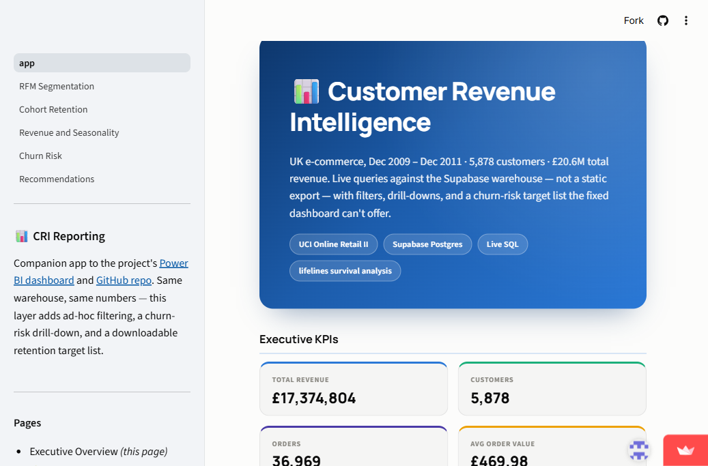

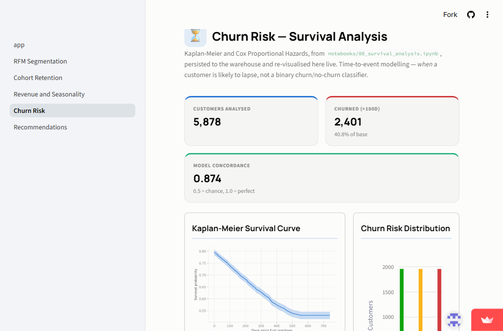

**One honest discrepancy, surfaced in-app rather than hidden:** the app's RFM segment counts are computed live via SQL `NTILE(5)` (`sql/compute_rfm.sql`), while the README/Power BI numbers above come from the notebook's pandas `pd.qcut`. Both follow the identical rule waterfall and agree closely, but small per-segment differences are expected — `pd.qcut` and SQL `NTILE` break quantile ties differently. The app's RFM page states this explicitly instead of quietly showing a slightly different number with no explanation.

**Deployment notes, worth knowing for a technical follow-up question:** the app has its own `requirements.txt` and `.streamlit/config.toml`, kept separate from the root notebook/pipeline `requirements.txt` so Community Cloud only installs what the app itself needs. `DATABASE_URL` is read from Streamlit's secrets manager (with a local `.env` fallback for development) — never committed. The first deploy attempt failed: Streamlit Cloud provisioned Python 3.14 by default, and neither `psycopg2-binary` nor `pandas` (at the versions pinned here) ship prebuilt wheels for it yet, so the build tried to compile both from source and failed. Fixed by pinning Python 3.11 via the app's Advanced Settings in the Streamlit Cloud dashboard — a repo-level `runtime.txt`/`.python-version` was tried first and silently ignored, since machine provisioning happens before the repo is even cloned.

---

## 💡 Business Recommendations

### 1. Fix the One-Hit Wonder Problem — £174K Annual Upside

79% of customers never return after their first purchase. Month 1 retention averages only 21.16%. A Day-7 thank-you email and Day-30 discount email sequence (10–15% offer) is a low-cost, high-return intervention. Even a 10% recovery rate on first-time buyers adds approximately £174,000 in annual revenue.

### 2. Recover £982,122 from 223 At-Risk Customers — £196K Immediately

223 customers classified as At Risk have not purchased in an average of 342 days. They collectively represent £982,122 in historical revenue. Their most-purchased product — WHITE HANGING HEART T-LIGHT HOLDER (bought by 105 of 223 At Risk customers) — is the recommended lead product for a targeted re-engagement campaign. A 20% recovery rate alone secures £196,424 in immediate revenue.

### 3. Prepare for the Observed Q4 Seasonal Pattern — Inventory & Acquisition Spend

Q4 monthly revenue was 41.33% higher than non-Q4 months in both years of this dataset — but with only 25 months of data, this doesn't clear the bar for statistical significance (Welch's p=0.052; see Statistical Validation). Where a Q4 lift does occur, it's volume-driven, not AOV-driven (more customers, not higher spend per order — this part *is* statistically confirmed, p=0.697). Given the pattern repeated in both observed years even without formal statistical proof, scaling ad spend from late September and completing stock replenishment by October 1 remains a reasonable operational precaution — but it should be treated as a well-supported working assumption, not a statistically guaranteed fact, until more years of data are available.

### 4. Protect the 1,297 Champions — £11.86M Revenue at Stake

Champions (22.07% of customers, 1,297 people) generate 68.26% of revenue. Champion average CLV is £9,144 versus £244 for Lost customers. A VIP loyalty tier — early sale access, free shipping, dedicated account support for the top 50 — directly protects £11.86M in Champion segment revenue from potential churn. Champions should never be treated like new customers.

*(Separately, the top 10% of customers by revenue — 587 people, not the same group as the Champions segment — generate 63.9% of total revenue; see notebook 05's Pareto analysis.)*

### 5. Convert Guest Checkouts to Accounts — £645,907 Trackable Revenue

£3,229,538.96 in revenue is currently unattributed to any customer record. These are 236,122 valid guest checkout transactions — 98.8% from UK customers. A post-checkout prompt offering a 5% future discount for account creation is a low-friction intervention. At 20% conversion, £645,907 becomes attributable, trackable, and eligible for retention campaigns.

### 6. Prioritise Retention Outreach by Cox Churn Risk Score, Not Just Recency

The survival analysis's per-customer Cox partial hazard score (`survival_customer_features.cox_partial_hazard`) ranks all 5,878 customers by relative churn risk, driven overwhelmingly by order frequency (HR≈0.07, concordance 0.87) rather than recency alone. Recommendation #2 above targets customers already 342 days lapsed; this score identifies customers whose *ordering pattern* signals elevated risk before they cross that threshold — a genuinely earlier, more targeted retention trigger than a recency cutoff. The [Streamlit app's Churn Risk page](https://zowhklizimdbzjpc2zaq7z.streamlit.app/Churn_Risk) turns this straight into an exportable, filterable target list rather than leaving it as a table only a SQL query away.

---

## 🔑 Key Insights Summary

- **£20,604,343.21** in true total business revenue (£17.37M identified + £3.23M guest checkout)
- **22.07% of customers** (Champions) generate **68.26% of revenue** — Pareto confirmed and exceeded
- **Top 32% of customers** generate **80.23% of revenue** — Pareto holds at segment level too
- **79% of customers** never return after their first purchase
- **Average Month 1 retention: 21.16%** across all 25 cohorts analysed
- **Best cohort retention: 35.29%** (December 2009) — **Worst: 9.21%** (December 2010)
- **Q4 monthly revenue was 41.33% higher** than non-Q4 in the observed data — but not statistically significant with only 25 months available (Welch's p=0.052); AOV difference is not significant either (p=0.697), so where a Q4 effect exists it's volume-driven, not spend-per-order-driven
- **Champion avg CLV: £9,144** vs **Lost avg CLV: £244** — a **37.5x difference**
- **Non-UK customers place £441 larger orders** than UK customers (p~0.000)
- **21.43% of products** generate **80% of revenue** — product-level Pareto confirmed
- **~41% of customers have crossed the 180-day churn threshold**; order frequency (not order value or country) is the dominant churn-hazard driver (Cox HR≈0.07, concordance 0.87)

---

## 🚀 How to Reproduce

### Prerequisites

- Python 3.10+
- MySQL 8.0 (optional — only needed for the local SQL-practice track)
- A free [Supabase](https://supabase.com) account (for the cloud warehouse)
- Power BI Desktop + the [psqlODBC](https://www.postgresql.org/ftp/odbc/versions/) driver (only if you want to reconnect the dashboard)
- Kaggle/UCI account (to download the dataset)

### Step 1 — Clone the repository

```bash
git clone https://github.com/ShreenivasSB/customer-revenue-intelligence.git
cd customer-revenue-intelligence
```

### Step 2 — Install Python dependencies

```bash
pip install -r requirements.txt
```

### Step 3 — Configure credentials

```bash
cp .env.example .env
```

Fill in your local MySQL credentials (if using the local track) and your Supabase `DATABASE_URL` (use the **session pooler** connection string — see the comments in `.env.example` for why). `.env` is gitignored; never commit real credentials.

### Step 4 — Local exploratory track (notebooks)

```bash
jupyter notebook
```

Execute notebooks in sequence — each builds on the previous one's output:
1. `01_data_quality_audit.ipynb`
2. `02_data_cleaning.ipynb`
3. `03_rfm_segmentation.ipynb`
4. `04_cohort_analysis.ipynb`
5. `05_revenue_trends.ipynb`
6. `06_clv_analysis.ipynb`
7. `07_statistical_tests.ipynb`
8. `08_survival_analysis.ipynb` (reads/writes the Supabase warehouse directly — run Step 5 first)

Processed data exports to `data/processed/`. To populate the local MySQL warehouse, create a database and run `mysql -u root -p customer_revenue_intelligence < sql/schema_ddl.sql`, then `python scripts/ingest_to_mysql.py`.

### Step 5 — Production track (Supabase + GitHub Actions)

- Create a Supabase project and grab its connection string.
- To run the pipeline **locally**: `python scripts/clean_data.py && python scripts/data_quality_gate.py && python scripts/load_to_supabase.py` — this ensures the schema, truncates, reloads, and recomputes RFM in SQL.
- To run it as **automated CI**: fork/push to your own repo, add `DATABASE_URL` as a GitHub Actions repository secret (Settings → Secrets and variables → Actions), then either push a change to a pipeline file, trigger it manually from the Actions tab (`ETL Pipeline` → `Run workflow`), or wait for the Monday 03:00 UTC schedule.

### Step 6 — Run the SQL query files

Execute `sql/rfm_queries.sql`, `sql/revenue_queries.sql`, `sql/cohort_queries.sql`, `sql/advanced_queries.sql` against the local MySQL warehouse in MySQL Workbench or CLI.

### Step 7 — Open the Power BI dashboard

Open `dashboard/customer_revenue_intelligence.pbix` in Power BI Desktop. If reconnecting, point it at Supabase — try the native `PostgreSQL.Database` connector first; if you hit a TLS validation error, see the ODBC workaround in [Data Warehouse](#data-warehouse).

### Step 8 — Run the Streamlit app locally (optional)

```bash
cd streamlit_app
pip install -r requirements.txt
streamlit run app.py
```

Reads `DATABASE_URL` from the repo-root `.env` automatically (same variable as Step 3). To deploy your own copy on [Streamlit Community Cloud](https://share.streamlit.io): New app → this repo → branch `main` → main file path `streamlit_app/app.py` → add `DATABASE_URL` under App settings → Secrets. If the build fails trying to compile `psycopg2-binary`/`pandas` from source, set the Python version explicitly to 3.11 under the app's Advanced Settings — see the deployment note in [Streamlit Reporting App](#streamlit-reporting-app).

---

## 📁 Project Structure

```
CUSTOMER_REVENUE_INTELLIGENCE/
│
├── .github/
│   └── workflows/
│       └── etl_pipeline.yml
│
├── dashboard/
│   └── customer_revenue_intelligence.pbix
│
├── data/
│   ├── processed/
│   │   ├── online_retail_clean.csv
│   │   ├── guest_checkout.csv
│   │   ├── cleaning_summary.json
│   │   └── rfm_segments.csv
│   └── raw/
│       └── online_retail_II.xlsx
│
├── notebooks/
│   ├── 01_data_quality_audit.ipynb
│   ├── 02_data_cleaning.ipynb
│   ├── 03_rfm_segmentation.ipynb
│   ├── 04_cohort_analysis.ipynb
│   ├── 05_revenue_trends.ipynb
│   ├── 06_clv_analysis.ipynb
│   ├── 07_statistical_tests.ipynb
│   └── 08_survival_analysis.ipynb
│
├── reports/
│   └── figures/
│       ├── dashboard_page1_executive_revenue_overview.png
│       ├── dashboard_page2_customer_loyalty_rfm.png
│       ├── dashboard_page3_retention_seasonal_trends.png
│       ├── dashboard_page4_executive_insights_roadmap.png
│       ├── pipeline_run_jobs.png
│       ├── pipeline_run_history.png
│       ├── survival_km_overall.png
│       ├── survival_km_country.png
│       ├── rfm_scatter.png / rfm_segment_analysis.png
│       ├── cohort_retention_heatmap.png / cohort_retention_trend.png
│       ├── clv_analysis.png
│       ├── pareto_analysis.png
│       ├── monthly_revenue_trend.png
│       ├── streamlit_app_home.png
│       └── streamlit_app_churn_risk.png
│
├── scripts/
│   ├── clean_data.py           — cleaning waterfall, scripted for CI
│   ├── data_quality_gate.py    — 17 automated PASS/FAIL checks
│   ├── load_to_supabase.py     — schema + load + SQL RFM computation
│   └── ingest_to_mysql.py      — local MySQL ingestion
│
├── streamlit_app/
│   ├── app.py                  — Executive Overview (entrypoint)
│   ├── pages/                  — RFM, Cohort, Revenue, Churn Risk, Recommendations
│   ├── db.py                   — cached SQL query layer
│   ├── theme.py / ui.py        — chart palette + shared UI components
│   ├── requirements.txt        — app-only deps (kept separate from root)
│   └── .streamlit/config.toml
│
├── sql/
│   ├── schema_ddl.sql              (MySQL — local)
│   ├── schema_ddl_postgres.sql     (Postgres — Supabase)
│   ├── survival_schema.sql         (Postgres — survival tables)
│   ├── compute_rfm.sql             (Postgres — RFM via NTILE(5))
│   ├── rfm_queries.sql
│   ├── revenue_queries.sql
│   ├── cohort_queries.sql
│   └── advanced_queries.sql
│
├── .env.example
├── .gitignore
├── README.md
└── requirements.txt
```

---

## 🛠️ Tech Stack

| Tool | Version | Purpose |
|---|---|---|
| Python | 3.10 (local) / 3.11 (CI) | EDA, data cleaning, analysis, statistical testing, survival analysis |
| Pandas | 2.2.2 | Data manipulation and transformation |
| Matplotlib / Seaborn | 3.8.4 / 0.13.2 | Visualisation within notebooks |
| SciPy | 1.13.0 | Statistical hypothesis testing (Welch's t-test, Shapiro-Wilk, Levene's, Mann-Whitney U, chi-square) |
| lifelines | 0.30.3 | Survival analysis — Kaplan-Meier estimator, Cox Proportional Hazards |
| MySQL | 8.0 | Local warehouse — SQL query practice/demonstration |
| Supabase (Postgres) | — | Cloud-hosted production data warehouse, free tier |
| SQLAlchemy | 2.0.30 | Python-to-database ingestion (MySQL and Postgres) |
| psycopg2-binary | 2.9.9 | Postgres driver |
| GitHub Actions | — | CI/CD orchestration — scheduled + manual + push-triggered ETL pipeline |
| Power BI Desktop | Latest | 4-page executive dashboard; connects to Supabase via psqlODBC |
| Power BI Service | — | Live dashboard hosting (publish to web) |
| Streamlit | 1.54.0 | Interactive reporting app — filters, drill-downs, live SQL |
| Plotly | 5.24.1 | Interactive charts within the Streamlit app |
| Streamlit Community Cloud | — | Free-tier hosting for the reporting app |
| GitHub | — | Version control |

---

## 👤 Author

**Shreenivas S B**
MCA — Data Science | Dayananda Sagar University, Bangalore

[](https://www.linkedin.com/in/shreenivas-s-b-22b48a31a/)
[](https://github.com/ShreenivasSB)

---

*This project uses historical CLV calculated from verified transaction records — not predictive modelling. Data ingestion is a real automated pipeline: GitHub Actions cleans, quality-gates (17 automated checks), and loads data into a cloud Postgres warehouse on a weekly schedule, with every load idempotent and every failed check blocking production. Survival analysis models time-to-churn directly via Kaplan-Meier and Cox Proportional Hazards rather than a binary classifier, with its proportional-hazards assumption check and remediation reported honestly — including the one violation that couldn't be fully resolved. The Streamlit app is a reporting/BI layer on the same warehouse, not a deployed model — the one place it surfaces a model output (the Cox risk score), it displays and ranks a value already computed and persisted by the notebook, rather than serving live inference. All statistical results, including non-significant findings, are reported as observed.*
